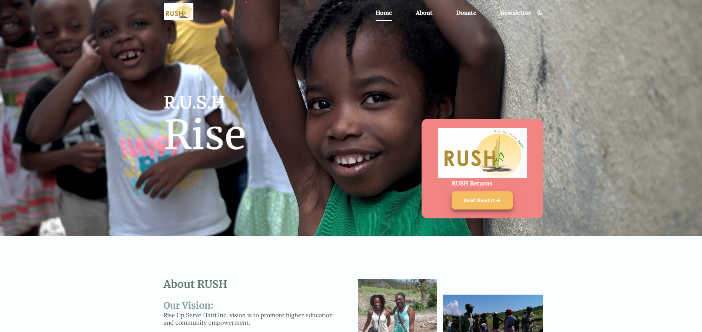

# Final Exam Project

## Table of contents

- [Overview](#overview)
  - [The challenge](#the-challenge)
  - [Screenshot](#screenshot)
  - [Links](#links)
- [My process](#my-process)
  - [Built with](#built-with)
  - [What I learned](#what-i-learned)
  - [Continued development](#continued-development)
  - [Useful resources](#useful-resources)

## Overview
RUSH- Rise Up Serve Haiti Organization Page

### The challenge

Users should be able to:

- Learn about the RUSH organization 
- Navigate using the tabs through an about, donate and newsletter sections
- Press the moon button to view the webpage in dark mode
- Press the toggle button in mobile view to see the hamburger nav menu 

### Screenshot

### Links

- Solution URL: https://github.com/Jud1th1/responsive-final
- Live Site URL: 

## My process
-	Using the files provided to me I created a GitHub repo to place everything a set up my webpage
- I linked the style and main.js files to activate the predeveloped code and styling
- I added my updates to the title to reflect the organization of my choosing along with adding images and a video file 
- I also updated the html links and text as well as the social media links
- I choose new serif fonts and a cursive font because it matched my theme well and I knew I wanted to add a quote in creole. A lot of Haitians learn cursive so that is why I wanted a cursive font for my quote
- I add another html page for the founder and removed any unnecessary elements, and update the paragraph and images.  
- I changed the colors in the stylesheet to match my own theme which was based on the organizations logo color. 
- I added border-radius to the buttons to give them a curve, and some shadow as well to make them stand out more
- In my JavaScript code I added a dark mode by providing a theme switcher function to the webpage and used a localStorage to store the users input so it remember their preference and stays their
- I found a great code for my title that would morph the text to spell out the title one word at a time and carefully implemented that into my JavaScript, making sure I did not ruin any previous code. 
- Then I added final touches like removing the second button from the heading image because it caused to much clutter, I adjusted some fonts, added image shadows and fixed some links. 

### Built with

- HTML
- CSS 
- Javascript
- Responsive mobile & web design

### What I learned
-  I learned how to edit previous code to make my own changes adding links, additional JavaScript, and my own styling 

### Continued development
-	I would love to learn how to have a translation feature to have a Creole and French feature added for my target audience. 
-	With more time I would also like to add screen reading accessibility features 

### Useful resources
- https://blog.devgenius.io/how-to-create-a-dark-light-theme-switch-using-html-css-and-javascript-d8e466dcd979 //how to create dark mode/light mode theme
- https://favicon.io/favicon-converter/    //favicon converter
- https://getcssscan.com/css-box-shadow-examples    //box-shadow helper
- https://alvarotrigo.com/blog/css-text-animations/    //text animation inspiration

